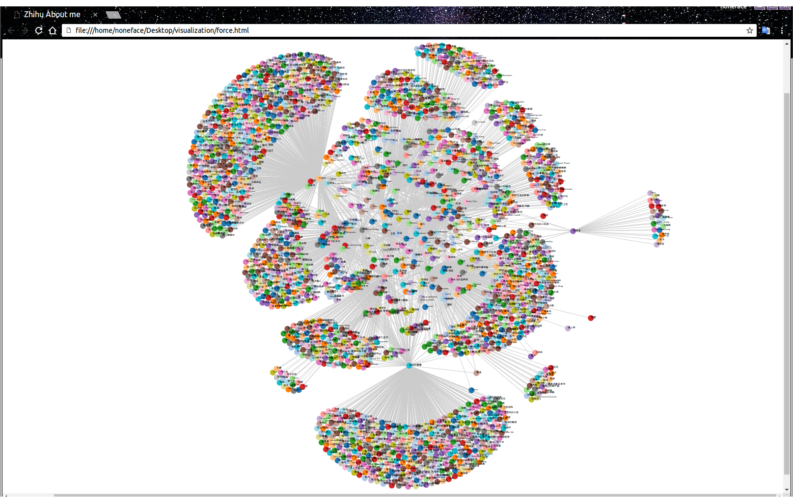

# Zhihu Python

在github上有一个知乎的[python项目](https://github.com/egrcc/zhihu-python)

提供了获取知乎数据的python包。不过看起来项目没有更新了，部分功能原始项目中无法使用。

通过简单修改项目源代码，大部分是在请求中加入header，就能够成功运行了。

# Zhihu Spider

这次的目标是，通过我的知乎，去获取我关注的人，再到我关注的人里面，获取他们关注的人，有点像是广度优先遍历，层次遍历。

把获取到的用户数据存入两张表，一张是获取到所有用户的表，另一张是关注和被关注的表。

这里用到的是sqlite数据库，方便好用。


def spider():
	goal = 2     #  爬虫目标深度
	Depth = 0
	while not userList.empty() and Depth < goal:

		userUrl,deep  = userList.get()

		if deep > goal-1:
			break

		try:
			userUrl = userUrl.replace('https','http')  #  url统一成http
		except:
			pass

		if userUrl in userVisited:   # 防止重复访问
			continue

		userVisited.add(userUrl)

		user = User(userUrl)  # zhihu-python User API
		followees = user.get_followees()
		username = user.get_user_id()

		insertIntoUser(username, userUrl, deep)  #  当前用户数据写入User表

		print "".join(  [ termcolor.colored("[*]Origin", "red"), ": ", termcolor.colored(username, "green")])  # 终端提示
		print "".join(	[termcolor.colored("[*]Deep", "blue"), ": ", termcolor.colored(deep, "green")] )

		try:
			for followee in followees:    #  获取关注的人
			
				try:
					ee_url = followee.user_url.replace('https','http')
				except:
					pass
			
				followee_name = followee.get_user_id()
			
				if ee_url not in urlSet:
					userList.put((ee_url, deep+1))
					urlSet.add(ee_url)
			
				insertIntoRelationship(ee_url,userUrl)   #  将关系写入数据库

			time.sleep(1)
			print "".join(	[termcolor.colored("[*]Have a break!", "magenta")] )

			Depth = deep  #  获取深度
		except:
			pass
	
	while not userList.empty():   #  存入目标最后一层的用户
		userUrl,deep  = userList.get()

		if userUrl in userVisited:
			continue

		userVisited.add(userUrl)
		try:
			user = User(userUrl)

			username = user.get_user_id()
			insertIntoUser(username, userUrl, deep)
		except Exception, e:
			pass



目前只尝试到了第三层，用户数量在2900人不到。

# Data Visualization for relations network

枯燥的数据看起来肯定好无聊，所以打算将网络可视化。

用到了D3.js这个框架的force图。

最后效果是这样的：

EOF	